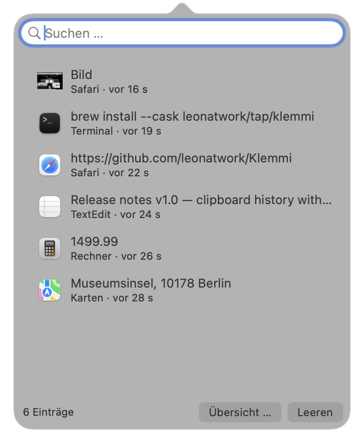
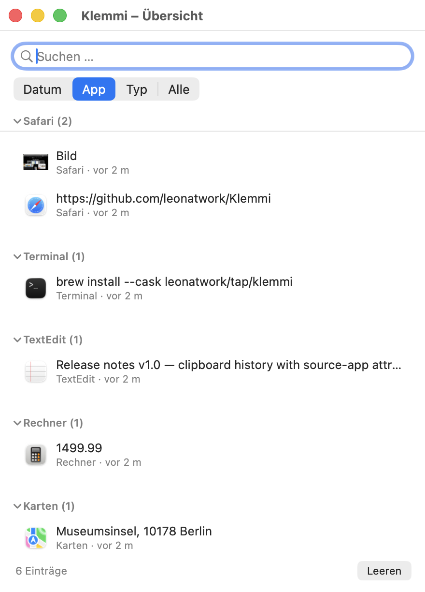

# Klemmi

Klemmi ist eine kleine native macOS-App, die einen durchsuchbaren Verlauf der Zwischenablage führt – Text und Bilder, jeweils mit Zeitstempel und der App, aus der der Inhalt kopiert wurde. Ersatz für Tools wie Pasta.

  [](LICENSE)

*🇬🇧 [English version](README.md) — die englische Fassung ist maßgeblich und wird zuerst aktualisiert.*

## Screenshots

<div align="center">
  
  <br />
  <em>Menüleisten-Popover — jeder Eintrag zeigt, aus welcher App er stammt</em>
  <br /><br />
  
  <br />
  <em>Übersichtsfenster, gruppiert nach Quell-App</em>
</div>

## Funktionen

- **Menüleisten-Symbol**: Klick öffnet ein kompaktes Popover mit dem Verlauf, Rechtsklick ein Menü (Übersicht öffnen, Dock-Symbol ein-/ausblenden, sensible Inhalte ignorieren, Verlauf leeren, Beenden).
- **Übersichtsfenster**: größere Fensteransicht mit Gruppierung nach **Datum** (Heute/Gestern/Diese Woche/älter), **App** oder **Typ** (Text/Bilder) – erreichbar über „Übersicht …“ im Popover oder Rechtsklick-Menü.
- **Erfasst Text und Bilder** aus der Zwischenablage – jeder Eintrag zeigt, aus welcher App er stammt (Name + Icon) sowie eine relative Zeitangabe.
- **Suche** über Text und Quell-App, sowohl im Popover als auch im Übersichtsfenster.
- **Zurück in die Zwischenablage**: Doppelklick auf einen Eintrag (bzw. Rechtsklick → „In Zwischenablage kopieren“ im Übersichtsfenster) kopiert ihn wieder in die Zwischenablage (Einfügen erfolgt manuell per ⌘V).
- **Persistenz**: Verlauf liegt unter `~/Library/Application Support/Klemmi` (Bilder als PNG, Metadaten als JSON) und übersteht einen Neustart der App.
- **Begrenzung**: Standardmäßig die letzten 200 Einträge, ältere fallen automatisch raus (samt zugehöriger Bilddatei).
- **Respektiert Passwort-Manager**: Inhalte, die per `org.nspasteboard.ConcealedType`/`TransientType`-Konvention als sensibel markiert sind (z. B. aus 1Password), werden standardmäßig nicht gespeichert (abschaltbar).

### Bekannte Grenzen (v1)

- Die Quell-App wird über die zum Zeitpunkt des Kopierens vorderste App ermittelt (macOS liefert keine direkte Quellangabe über die Zwischenablage) – in der Regel zuverlässig, aber kein Systemgarantie.
- Kein automatisches Einfügen per Tastenkombination (würde Bedienungshilfen-Rechte erfordern) – ein Eintrag landet nur in der Zwischenablage, eingefügt wird klassisch per ⌘V.
- Kein globales Tastaturkürzel zum Öffnen des Popovers, nur Klick auf das Menüleisten-Symbol.

## Bauen

Voraussetzung sind die Xcode Command Line Tools – weitere Abhängigkeiten gibt es nicht.

```bash
./build.sh
```

Das Skript kompiliert die Quellen, erzeugt das App-Symbol und legt `Klemmi.app` in `~/Applications` ab.

## Aufbau

| Datei | Inhalt |
| --- | --- |
| `Sources/main.swift` | App-Delegate, Einstiegspunkt |
| `Sources/StatusItem.swift` | Menüleisten-Symbol, Popover, Kontextmenü |
| `Sources/HistoryList.swift` | Tabellenansicht des Verlaufs samt Suche (Popover) |
| `Sources/MainWindow.swift` | Übersichtsfenster mit Gruppierung nach Datum/App/Typ |
| `Sources/ClipboardMonitor.swift` | Pollt die Zwischenablage, erkennt Quell-App |
| `Sources/HistoryStore.swift` | Verlauf im Speicher + Persistenz auf Platte |
| `Sources/HistoryItem.swift` | Datenmodell eines Eintrags |
| `Sources/Clipboard.swift` | Schreibt einen Eintrag zurück in die Zwischenablage |
| `Sources/Support.swift` | Einstellungen (UserDefaults) |
| `icon.swift` | Erzeugt das App-Symbol als `.icns` |
